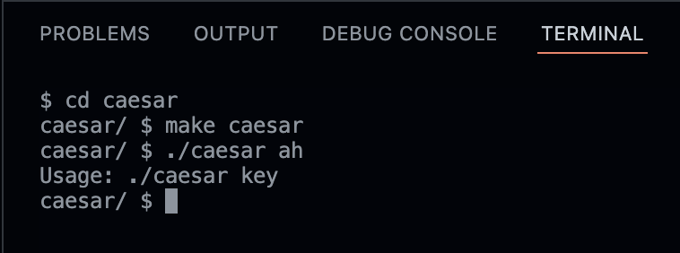
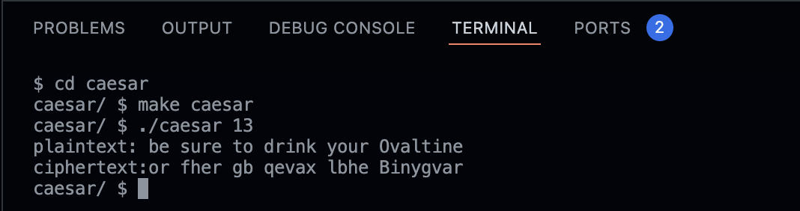
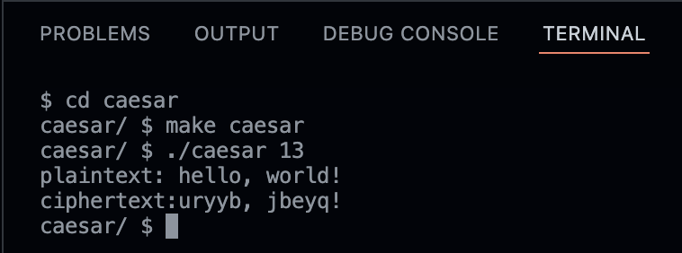

<h1 align="center"> Caesar Project </h1>

The user has to type in the command line the desired key to encrypt the message:

make caesar

./caesar key

## ___The program is based on ASCII values, where the given key will change the letters.___
 ---

The program will only accept a positive value. If the user enters more than one value or if the value is negative, the program will return an error message.

---
#### Example below the result for the use of key 13

---
